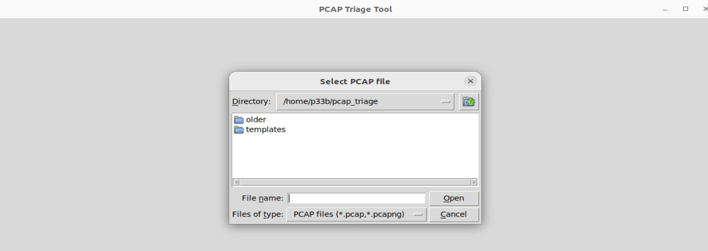
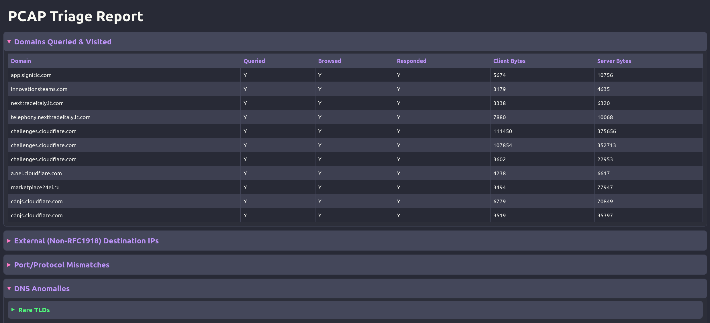

```markdown

# PCAP Triage Tool

A fast, flexible, GUI-driven Python tool for **automated triage and anomaly reporting** from PCAP files.  
Network defenders, threat hunters, and incident responders: get everything you need in one browser-ready report.

---

## Features

- **One-Pass Analysis:** Scans the PCAP in a single pass for maximum speed (handles multi-GB PCAPs easily)
- **Modern, Customizable GUI:** Select PCAP files, see progress, get a browser-based report—no command line needed
- **Exportable HTML Reports:** Collapsible, structured, and readable—ideal for briefings, audits, and hunt docs
- **Wide Module Coverage**:
  - External (non-RFC1918) destination IPs and protocol hierarchy
  - Domain Events Timeline that shows DNS Queries and says if the domain was browsed and if there was a resonse that shows client and server payload bytes (no header bytes counted)
  - Port/protocol mismatches (e.g., HTTP on non-standard ports)
  - DNS anomalies (failed lookups, long/random/rare domains, tunneling indicators)
  - HTTP(S) summaries (domains, methods, agents, files, content types, request bodies)
  - Suspicious flows (long, short, many small, scans, beacons)
  - File transfers (SHA256, macro-enabled docs, rare MIME types, sender/receiver IPs)
  - Credentials and sensitive data exposure (HTTP, FTP, SMTP, SNMP, Telnet)
  - Beaconing/timing patterns (periodic C2, RAT callbacks)
  - Protocol oddities (weak SSL/TLS, unknown transport/tunnels)
  - ARP and Layer 2 oddities (gratuitous ARP, spoofing, duplicate MAC/IP, noisy ARP hosts)
- **Customizable Ignore Lists:** Use `domain_ignore.txt` for noisy/known-safe domains (supports  `*example.com` wildcards)
- **Error-Resilient:** All errors logged to `pcap_triage_error.log`; you never lose a report due to one bad packet
- **Easy Extensibility:** Add your own analysis modules in the `PcapAnalyzer` class

---

## Screenshots

**GUI: Select a PCAP File**



**Sample Report: Triage Overview in Browser**



*(Screenshots above are included under the [CC0 1.0 Universal (Public Domain)](https://creativecommons.org/publicdomain/zero/1.0/) license.  
You are free to use, share, or remix for any purpose.  
Please contact me if you’d like to collaborate, cite, or contribute!)*

---

## Installation

**Requirements:**
- Python 3.8+ (recommend Python 3.10 or later)
- [PyShark](https://github.com/KimiNewt/pyshark)
- [Jinja2](https://palletsprojects.com/p/jinja/)
- (Optional for speed) [tshark](https://www.wireshark.org/docs/man-pages/tshark.html), [tcpdump](https://www.tcpdump.org/)

**Install dependencies:**
```sh
pip install pyshark jinja2
# For Ubuntu/Debian (and to get file select GUI):
sudo apt install tshark tcpdump python3-tk
````

**Clone and Run:**

```sh
git clone https://github.com/Pb-22/pcap-triage-tool.git
cd pcap-triage-tool
python pcap_triage.py
```

---

## Usage

1. **Run the script:**
   `python pcap_triage.py`
2. **Select a PCAP file** in the GUI.
3. **Wait for analysis** (live progress shown).
4. **Report opens automatically** in your browser (`pcap_report.html`).

**Output:**

* Clean, collapsible, browser-based report ready to archive, print, or copy to tickets

---

## Customization

### Ignore Known Domains

* Place a file named `domain_ignore.txt` in the script directory.
* Add one domain per line (e.g., `adobe.io` or `*.localdomain`).
* Wildcards (`*.`) are supported.

### Add New Detection Modules

* Extend the `PcapAnalyzer` class—add new fields and logic to `process_packet()`.
* New analysis is as simple as adding a new attribute and filling it during the scan.

---

## Troubleshooting

* **No report or browser error?**
  Check for errors in `pcap_triage_error.log`.
* **GUI not starting?**
  Ensure Python Tkinter is installed (`sudo apt install python3-tk` on Ubuntu/Debian).
* **PyShark errors about missing tshark?**
  Install Wireshark/tshark (`sudo apt install tshark`).

---

## FAQ

**Q: Does this modify my PCAP?**
A: No. All analysis is read-only and safe.

**Q: Can I use this on large PCAPs?**
A: Yes—single-pass, memory-light, progress-tracked.

**Q: Can I get the report as CSV/JSON instead?**
A: The default is HTML, but you can export CSV via browser (copy-paste). Feel free to add a JSON export—PRs welcome!

**Q: Is it safe for confidential material?**
A: All processing is local. Review the code to confirm.

---

## License

**Software, screenshots, and documentation are released under the [CC0 1.0 Universal (Public Domain)](https://creativecommons.org/publicdomain/zero/1.0/) license.**

You may freely use, share, remix, or commercialize this tool and its screenshots for any purpose, no attribution required (though it is appreciated).
*If you improve the tool, find bugs, or want to collaborate—please [contact me](mailto:brian@brimerica.com) or open a pull request!*

---

## Credits

* Written by \Pb-22 founder and CEO of BriMerica
* MIT/CC0 1.0 Universal Public Domain Dedication

---

*PRs and feedback welcome! For questions or suggestions, open an issue or contact me directly.*

```


